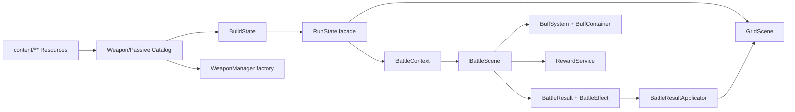

# 03｜工程架构

## 当前执行路径

## 关键边界

- `RunState` 是 Autoload 门面，构筑可变状态实际归 `BuildState`。
- Catalog 只拥有静态定义，不拥有运行时层数、持续时间、来源或目标。
- `WeaponManager` 按定义工厂实例化运行时节点，不按具体 ID 分支。
- 被动数值通过 `BuildAttributes` 聚合。
- 战斗入参使用 `BattleContext`，战斗出参使用 `BattleResult`。
- 跨场景结果使用类型化 `BattleEffect`，由 Applicator 修改阵列状态。
- 奖励核心使用 `RewardOption/RewardResolution`，场景仍经旧 Dictionary adapter。

## 当前 Buff 与目标 Effect 架构的关系

当前 `BuffDefinition/BuffInstance/BuffContainer/BuffSystem` 是已运行的轻量同步状态组件。它具有定义、实例、宿主和统一 tick 的雏形，但仍存在限制：

- 定义由 `BattleScene` 代码创建，尚未进入 Resource Catalog；
- 事件以 Dictionary 返回；
- 只处理时间 tick，没有完整战斗事件阶段；
- source/owner/因果链表达有限；
- 未形成类型化命令和递归保护。

因此后续不应另起一套完全平行系统，而应评估将当前 Buff 组件演进为通用 Effect 运行时，或明确其仅作为同步子系统。
